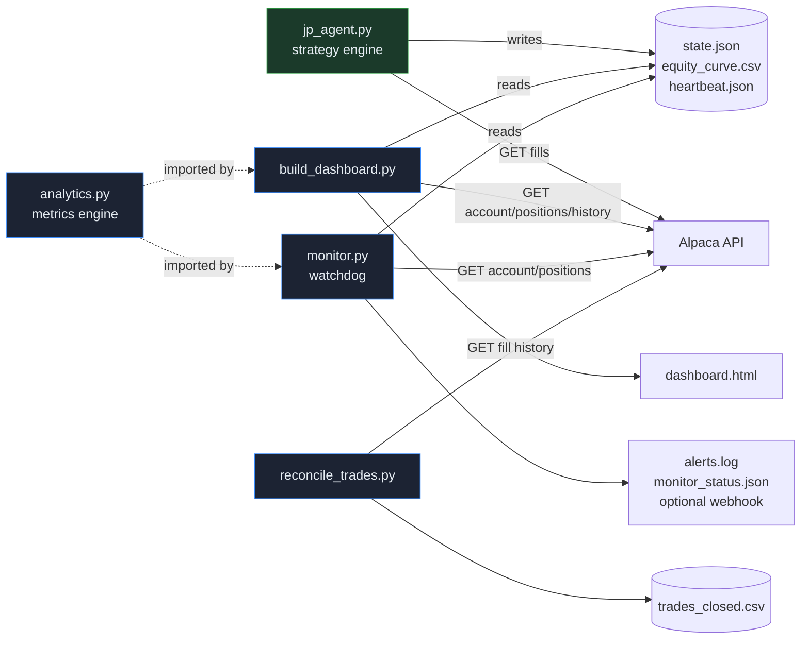

# JP Alpha Strategy v3

A systematic, bidirectional **mean-reversion swing-trading agent** running live on
Alpaca paper trading, wrapped in a **read-only observability stack** — a metrics
engine, a browser command center, and a watchdog with a dead-man's switch.

The strategy longs oversold names and shorts overbought names across a 42-stock
universe, with ATR-based position sizing, tiered profit-taking, and a market-regime
filter. It runs unattended once a day via cron and reports its own health.

> **Status:** live paper-trading research project. Not investment advice. See
> [Disclaimer](#disclaimer).

---

## Design philosophy

Two ideas shape the whole codebase:

1. **The strategy is frozen; the monitoring is additive.** Once the trading logic
   is validated, it is treated as immutable. Entries, exits, indicators, sizing,
   and execution live in `jp_agent.py` and are not modified to "improve" reporting.
   Everything else — analytics, dashboard, alerting — is layered *around* it and is
   strictly **read-only**: it places no orders and writes no trading state. This
   separation is deliberate. It keeps the track record honest and means a bug in a
   chart can never move the portfolio.

2. **Intellectual honesty over vanity metrics.** Risk-adjusted ratios (Sharpe,
   Sortino, Calmar) return `N/A` until there are ≥30 daily observations; trade
   statistics stay hidden below 10 closed trades. A Sharpe computed off 15 points
   is noise dressed as signal, and the code refuses to emit it.

---

## Architecture



The daily cron pipeline runs three stages in sequence:

```
jp_agent.py   →   build_dashboard.py   →   monitor.py
(trade)           (regenerate view)        (health-check + alert)
```

Each stage is independent and read-only except the agent itself.

---

## Strategy

**Long signal** (oversold reversion):
- Wilder RSI < 45
- Price ≥ 2% below its 20-day MA
- Volume exhaustion (capitulation spike or multi-day dry-up)
- Bullish intraday close (upper half of the day's range)
- Regime filter: SPY not more than 10% above its 50-day MA

**Short signal** (overbought reversion) — the exact mirror image (RSI > 60, price
≥ 2% above MA20, distribution volume, bearish close, SPY not > 10% *below* its MA50
so we never short a crash).

**Exits** (both directions, symmetric):

| Level | Trigger | Action |
|-------|---------|--------|
| T1 | ±4% | trim 25% |
| T2 | ±8% | trim 25% |
| T3 | ±12% | close remainder |
| Stop | 8% adverse move | exit all |
| Time stop | 21 days without hitting T1 | exit |
| Post-T1 stop | 30 days after T1 without T2 | exit remainder |

**Sizing & risk limits:**
- Equal risk — 1% of portfolio per 1.5-ATR move
- Max 10 simultaneous positions (≤7 long, ≤5 short), ≤2 per sector per direction
- Minimum price $10 (avoids wide-spread microcaps)

**Universe:** 42 stocks + ETFs across 9 sectors; SPY is the regime benchmark and is
not itself tradeable.

---

## Observability stack

The engineering value of this project lives here — a professional monitoring layer
built entirely from the standard library plus `requests` (no numpy/pandas needed to
read the track record).

### `analytics.py` — metrics engine
Pure, side-effect-free functions computing drawdown, Sharpe, Sortino, Calmar,
recovery factor, CAGR, trade statistics (win rate, profit factor, expectancy),
capital-at-risk, and exposure/concentration (Herfindahl index). Imports nothing
from the strategy engine; runs anywhere.

### `build_dashboard.py` — command center
Generates a single self-contained `dashboard.html` (Chart.js from CDN, dark theme).
Sections: liveness banner, hero tiles (equity / day P&L / open risk / drawdown),
equity curve + underwater drawdown chart, open positions sorted by open risk with
distance-to-stop/target, exposure & concentration, performance stats (with sample
guards), and recent closed trades. The equity curve is sourced from Alpaca's
portfolio-history endpoint, so the chart and risk metrics reflect true multi-week
history rather than only locally-accrued rows.

### `monitor.py` — watchdog & dead-man's switch
A standalone health monitor, separate from both the engine and the dashboard. Checks:

| Check | Condition | Severity |
|-------|-----------|----------|
| Dead-man's switch | `heartbeat.json` missing or older than the configured limit | CRITICAL |
| Run result | last run result ≠ `RUN_OK`, or errors reported | HIGH |
| Rejected orders | broker rejected any order last run | HIGH |
| Drawdown breach | current drawdown worse than the configured limit | HIGH |
| State divergence | positions at the broker not tracked in `state.json` (orphans), or tracked but not held (ghosts) | HIGH |

Emits a daily digest (with a weekly roll-up on Fridays), writes an append-only
`logs/alerts.log` audit trail and a machine-readable `monitor_status.json`, and
optionally pushes to a webhook if `ALERT_WEBHOOK_URL` is set. No credentials live
in the repo. Thresholds are configured in `config.json` under the `monitor` key.

### `reconcile_trades.py` — closed-trade ledger
Exit orders are submitted as day market orders after the close, so they fill at the
*next* session's open — meaning exit prices are unknown at close time. This module
reconstructs the true closed-trade ledger (`trades_closed.csv`) from Alpaca's actual
fill history using an average-cost, signed-position walk that correctly handles
partial closes, full closes, and direction flips.

---

## Repository layout

| File | Purpose | Writes trading state? |
|------|---------|:---:|
| `jp_agent.py` | Strategy engine — signals, risk, execution | **yes** (the only one) |
| `analytics.py` | Read-only performance & risk metrics engine | no |
| `build_dashboard.py` | Generates `dashboard.html` command center | no |
| `monitor.py` | Watchdog, dead-man's switch, alerting | no |
| `reconcile_trades.py` | Rebuilds closed-trade ledger from fills | no |
| `status.py` | Quick terminal P&L snapshot | no |
| `config.json` | Starting equity, cashflows, monitor thresholds | no |
| `.env.example` | Template for Alpaca credentials | — |
| `requirements.txt` | Python dependencies | — |

### Generated artifacts (git-ignored)
`equity_curve.csv`, `trade_log.csv`, `trades_closed.csv`, `positions_history.csv`,
`heartbeat.json`, `dashboard.html`, `monitor_status.json`, `logs/`, `state.json`.

---

## Setup

```bash
python3 -m venv venv
venv/bin/pip install -r requirements.txt
cp .env.example .env          # then fill in your Alpaca paper keys
venv/bin/python jp_agent.py   # one manual run
```

Generate the dashboard and run a health check:

```bash
venv/bin/python build_dashboard.py   # writes dashboard.html
venv/bin/python monitor.py           # prints digest, writes monitor_status.json
```

Optional push alerts — set a webhook (Slack/Telegram/Discord) in `.env`:

```
ALERT_WEBHOOK_URL=https://hooks.slack.com/services/...
```

---

## Schedule

The full pipeline runs once daily at 4:30 PM ET, Monday–Friday:

```cron
TZ=America/New_York
30 16 * * 1-5 /path/venv/bin/python /path/jp_agent.py        >> logs/cron.log 2>&1 ; \
              /path/venv/bin/python /path/build_dashboard.py  >> logs/cron.log 2>&1 ; \
              /path/venv/bin/python /path/monitor.py          >> logs/cron.log 2>&1
```

Stages are chained with `;` so the dashboard and monitor still run even if a prior
stage exits non-zero — you always get a fresh view and a health verdict.

---

## Track record

**Backtest (2020–2025):**
- CAGR 8.1% · Sharpe 0.66 · Max DD −10.9% · Profit Factor 1.53 · 249 trades
- Walk-forward validated: out-of-sample (PF 1.73) beat in-sample (PF 1.28)
- Monte Carlo: 99.4% of 500 simulations profitable

**Live paper-trading trial:** ongoing. Real-time equity curve, risk-adjusted
ratios, and trade statistics are computed by `analytics.py` and rendered on the
dashboard — with the sample-size guards described above, so early numbers are
labeled as such rather than presented as established edge.

---

## Design guarantees

- The monitoring layer imports nothing from `jp_agent.py`, places **zero** orders,
  and writes **no** trading state.
- Every Alpaca call in the monitoring layer is a `GET`.
- Secrets live only in `.env` (git-ignored); the repo ships an `.env.example`.
- Strategy parameters are changed only by editing `jp_agent.py` deliberately —
  never as a side effect of a reporting change.

---

## Disclaimer

This is a personal research project running on **paper trading**. It is not
investment advice, not a solicitation, and carries no guarantee of future results.
Backtested performance is hypothetical. Do not deploy with real capital without
independent validation.
